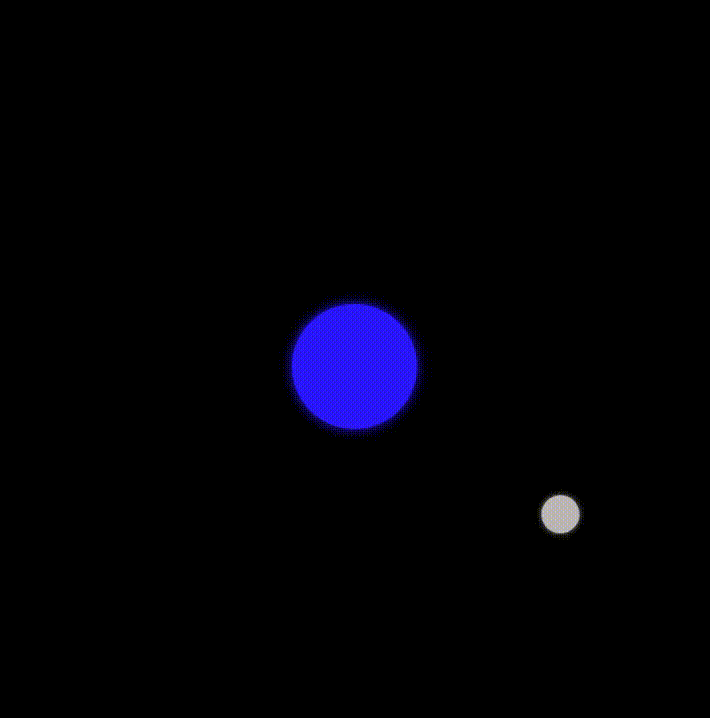

# 🌙 Moon Orbit Animation

This project demonstrates a simple **CSS animation** of the moon orbiting around the earth. It uses only **HTML and CSS**, no JavaScript required. The animation simulates orbital motion by rotating the moon around the earth using `@keyframes` and `transform-origin`.

---

## 📌 Table of Contents
- [Preview](#-preview)
- [Project Structure](#-project-structure)
- [Code Explanation](#-code-explanation)
  - [index.html](#indexhtml)
  - [styles.css](#stylescss)
- [Usage](#-usage)
- [Features](#-features)
- [License](#-license)

---

## 📸 Preview



---

## 📂 Project Structure

```plaintext
moon-orbit-animation/
    ├── images/
    │   └── animation-moon-orbit.gif
    ├── .gitignore
    ├── index.html
    ├── MIT LICENSE
    ├── README.md
    └── styles.css
```

## 📝 Code Explanation
### `index.html`
The HTML defines the structure:

- `.space` → the container for the orbit system.

- `.earth` → a blue circle representing Earth.

- `.orbit` → the rotating container.

- `.moon` → a gray circle that rotates around the Earth.

```css
<div class="space">
  <div class="earth"></div>
  <div class="orbit">
    <div class="moon"></div>
  </div>
</div>
```

### `styles.css`
The CSS handles layout and animation:

- The `background` is black to simulate space.

- `.earth` is centered inside .space and styled as a glowing blue planet.

- `.moon` is a smaller gray circle with a shadow for depth.

- `.orbit` rotates infinitely around the bottom-right corner using:

```css
@keyframes orbit {
  0% { transform: rotate(0deg); }
  100% { transform: rotate(360deg); }
}
```

- The key property is:
```css
transform-origin: 100% 100%;
animation: orbit 5s linear infinite;
```
    - This ensures the moon orbits around the Earth smoothly.

## 🚀 Usage
1. Clone the repository:
```bash
git clone https://github.com/<your-username>/moon-orbit-animation.git
```

2. Open the project folder:
```bash
cd moon-orbit-animation
```

3. Open index.html in your browser to see the animation.

## 🎨 Features
- Pure HTML + CSS (no JavaScript).

- Responsive animation scaling with container.

- Customizable animation speed (adjust 5s in styles.css).

- Simple, minimalistic code—great for learning CSS animations.

## 📜 License
This project is licensed under the MIT License.